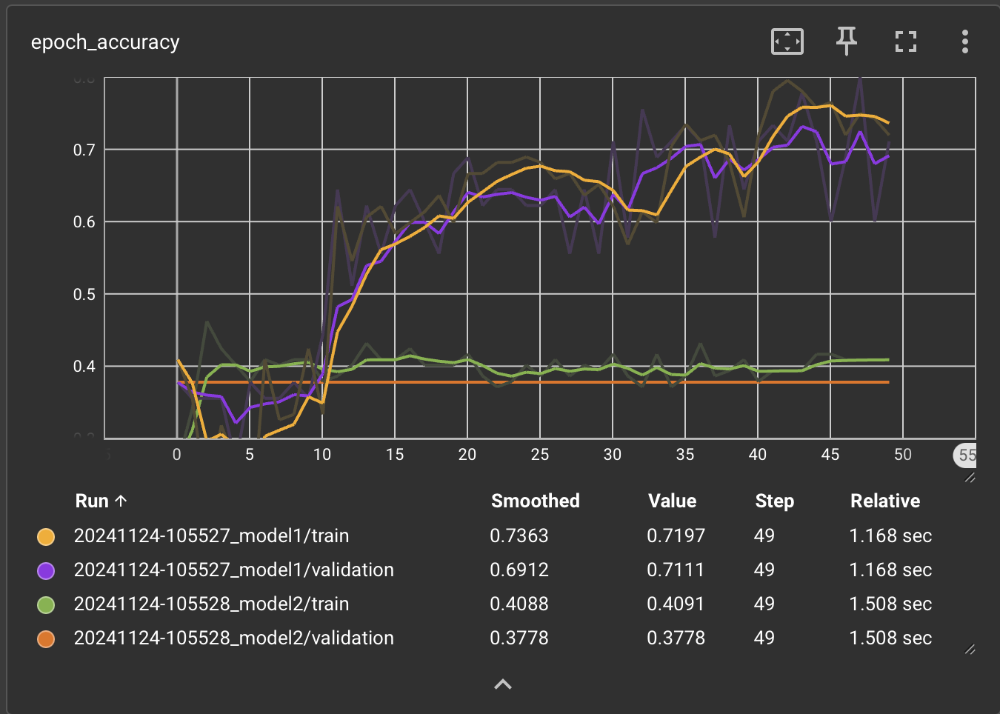
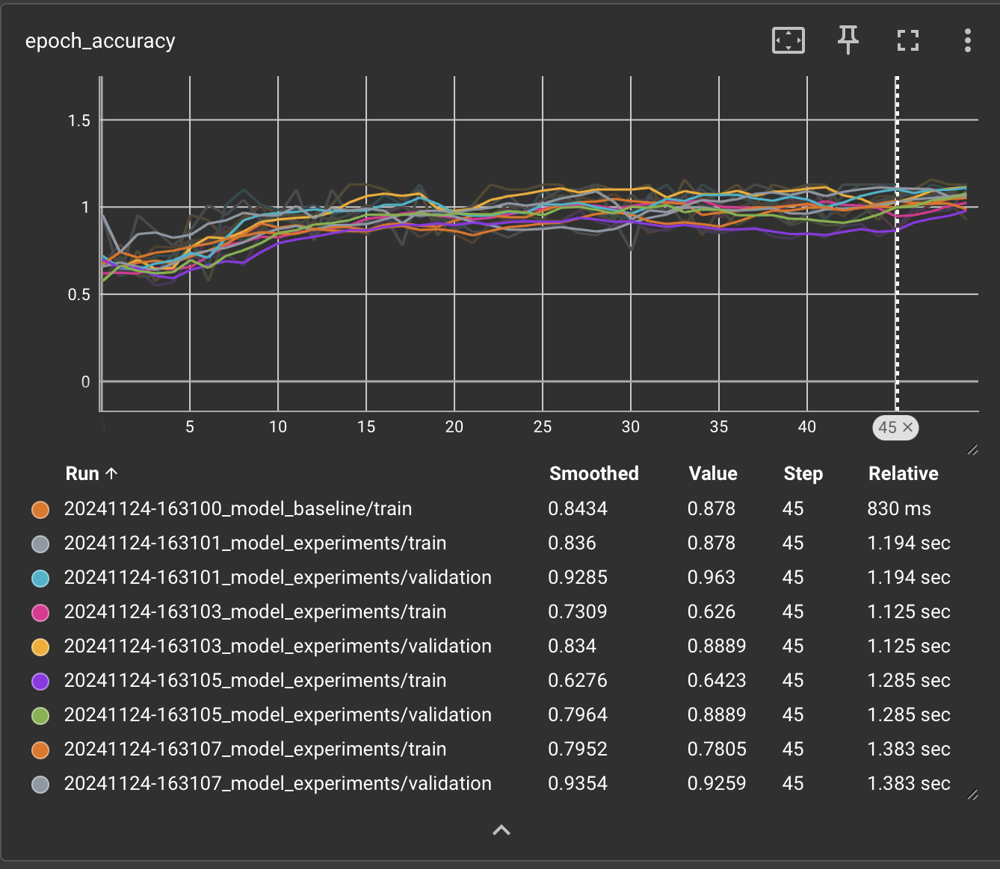

# College Exercise: TensorFlow Projects

This repository contains two projects demonstrating fundamental TensorFlow-based machine learning and mathematical operations. Each project is organized in its own directory, with individual files explaining important functionality.

## Table of Contents
- [Project 1: MNIST Digit Classifier](#project-1-mnist-digit-classifier)
- [Project 2: TensorFlow Math Functions](#project-2-tensorflow-math-functions)
- [Project 3: Wine Classification](#project-3-wine-classification)

---

## Project 1: MNIST Digit Classifier

**Folder:** `Lab1`

### Overview
This project builds a simple neural network using TensorFlow to recognize handwritten digits from the MNIST dataset. The model is saved to a file after training to avoid retraining on subsequent runs. The code includes a function to load an external image and classify it as one of the digits (0-9).

### Features
1. **Model Saving & Loading**: The model is saved to `model.keras` after training. If the file exists, it is loaded instead of retraining.
2. **Image Preprocessing**: The code uses PIL to preprocess and invert an input image for model compatibility.
3. **Digit Prediction**: After loading a preprocessed image, the model outputs a prediction showing the recognized digit.

### Usage
1. Run the code with Python.
2. To test the model with an image, save a digit image as `three.png` (or another name) and place it in the root directory.
3. Modify `img_path` in the script to point to the image filename.

### Key Files
- `model.keras`: Contains the trained model (created after the initial run).
- `three.png`: Sample image file for testing prediction.

---

## Project 2: TensorFlow Math Functions

**Folder:** `Lab2`

### Overview
This project contains TensorFlow functions for various mathematical computations. These include point rotation on a 2D plane, angle-based point rotation, solving linear equation systems using matrix methods, and a command-line interface for matrix input.

### Tasks
1. **Rotate Point**: Rotates a 2D point around the origin by a specified angle.
2. **Solve Linear System**: Solves a linear equation system `Ax = B` using matrix operations.
3. **Command Line Interface**: The main program allows users to input a linear equation system as matrices through the command line.

### Usage
1. **Command Line Usage**:
    ```shell
    python TensorMatrix.py '[[matrix_coefficients]]' '[[results_vector]]'
    ```
   - For example, to solve `2x + 3y = 8` and `x - y = 2`, use:
     ```shell
     python TensorMatrix.py '[[2.0, 3.0], [1.0, -1.0]]' '[[8.0], [2.0]]'
     ```

### Key Files
- `TensorMatrix.py`: Core file with rotation functions, linear system solver, and CLI setup.


## Project 3: Wine Classification
**Folder:** `Lab3`
### Models description
`Model 1` is very simple with `3 layers`. Using `relu` and `softmax` at output.\
```python
model1 = tf.keras.Sequential([
    tf.keras.layers.Dense(64, activation='relu', input_shape=(X_train.shape[1],), name='Layer_1'),
    tf.keras.layers.Dense(32, activation='relu', name='Layer_2'),
    tf.keras.layers.Dense(3, activation='softmax', name='Output_Layer')
])
```
`Model 2` is more complicated with `6 layers`. Using `relu`, `dropout` and `softmax` as a normal layer and on output.
```python
model2 = tf.keras.Sequential([
    tf.keras.layers.Dense(128, activation='relu', input_shape=(X_train.shape[1],), name='Layer_1'),
    tf.keras.layers.Dense(64, activation='relu', name='Layer_2'),
    tf.keras.layers.Dropout(0.5, name='Dropout_Layer'),
    tf.keras.layers.Dense(32, activation='relu', name='Layer_3'),
    tf.keras.layers.Dense(16, activation='softmax', name='Layer_4'),
    tf.keras.layers.Dense(3, activation='softmax', name='Output_Layer')
])
```
### Accuracy of models


### Conclusions
`Model 1` is far better than `Model 2`. It is simplier, smaller amount of layers and more rarely to overfitting data from wine.data which is not large set.

## Project 4: Wine Classification #2
**Folder:** `Lab4`

### Description/Summary
In this task, we created a `neural network` model for `wine classification` based on a dataset containing various chemical properties of wines. The goal was to `optimize the model’s hyperparameters`, such as the `number of neurons in layers` and the `learning rate`, to `improve` results compared to the baseline model created in previous sessions.

We started by splitting the data into three subsets: `training`, `validation`, and `test sets`, ensuring a consistent split every time the code is run. Next, we created the `baseline model`, which served as a `reference point`. Results were recorded for the `validation` and `test` sets based on this model.

Then, we organized the code so that the `model creation process` is handled by a separate function that accepts parameters like the `number of neurons` in layers and the `learning rate`, and `returns the model`. We performed `experiments` with `different combinations` of these parameters to `identify the best configuration`. 

The results of the experiments were saved in a table, and the `best model` was tested on the test set and compared to the baseline model. Using `TensorBoard`, we visualized the training process, which helped in analyzing the model's performance.

The entire process was `automated`, and the script tested all parameter combinations, `generating` a results table and identifying the `best model`.

### Accuracy of models
`Baseline` and `all experiment models`
